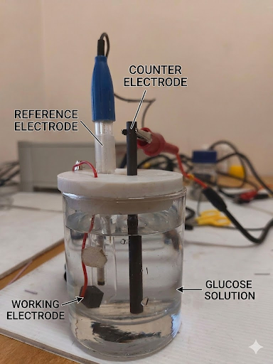
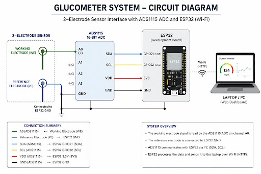
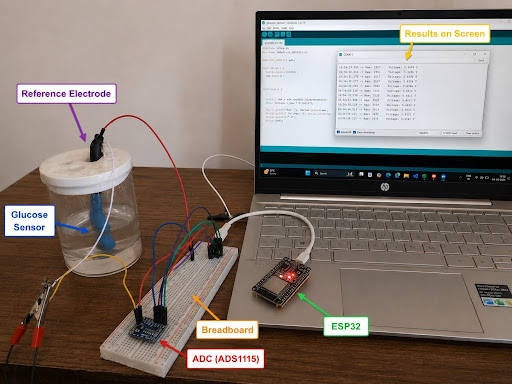
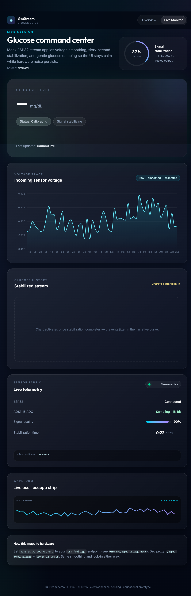

# Non-Invasive Glucose Detection System

*A biosensing + embedded systems + real-time web dashboard project for continuous glucose trend monitoring using sweat signals.*

---

# Overview

This project is a **non-invasive glucose monitoring prototype** designed to explore the feasibility of detecting glucose-related trends using **electrochemical sweat sensing**, analog signal processing, embedded systems, and a real-time web dashboard.

The system captures extremely low-amplitude biological signals from a custom electrochemical sensor setup, processes them using an ESP32-based acquisition pipeline, and visualizes the data through a live MERN-stack dashboard.

Unlike traditional finger-prick glucometers, this project focuses on a **continuous and non-invasive approach** using sweat as the sensing medium.

---

# Key Features

- Non-invasive glucose trend monitoring concept
- Electrochemical sweat sensing prototype
- ESP32-based real-time ADC acquisition
- Analog front-end for low-voltage signal amplification
- Noise filtering and signal stabilization
- Real-time data transmission using HTTP/WebSockets
- Live React dashboard for visualization
- Voltage waveform monitoring
- Signal quality tracking
- Modular architecture for future ML integration
- Designed for wearable and continuous monitoring exploration

---

# System Architecture

```text
Electrochemical Sensor
        ↓
Analog Front-End Circuit
        ↓
ADS1115 / ESP32 ADC
        ↓
ESP32 Firmware
        ↓
HTTP / WebSocket Streaming
        ↓
Backend Server
        ↓
React Dashboard
```

---

# Hardware Components

| Component | Purpose |
|---|---|
| ESP32 | Main microcontroller and wireless communication |
| Electrochemical Sensor Electrodes | Sweat signal acquisition |
| ADS1115 ADC | High-resolution analog-to-digital conversion |
| Analog Front-End Circuit | Signal conditioning and amplification |
| Jumper Wires | Circuit connections |
| Breadboard / PCB | Prototyping |
| Power Supply | System powering |
| Beaker + Sweat Sample | Testing medium |

---

# Sensor Setup

The sensing mechanism uses an electrochemical setup consisting of:

- Working Electrode (WE)
- Reference Electrode (RE)
- Counter Electrode (CE)

The electrodes are immersed in a sweat sample solution inside a beaker for signal acquisition and experimentation.

---

# Prototype Images

## Sensor + Beaker Setup



---

## Circuit Connections



---

## Complete Prototype



---

# Software Stack

## Frontend
- React
- TypeScript
- Vite
- Tailwind CSS

## Backend
- Node.js
- Express
- WebSockets / HTTP APIs

## Embedded / Firmware
- ESP32 Firmware (Arduino Framework)

---

# Dashboard Features

The dashboard provides:

- Live voltage monitoring
- Glucose trend visualization
- Sensor activity tracking
- Real-time waveform display
- Signal quality indicators
- Continuous streaming updates

---

# Dashboard Preview



---

# Signal Processing

Biological signals obtained from sweat are extremely noisy and low amplitude.

To improve stability and readability, the system applies:

- Noise filtering
- Signal smoothing
- Threshold-based analysis
- Trend extraction techniques

The objective is not just raw signal collection, but extracting meaningful glucose-related patterns from unstable biological data.

---

# Real-Time Communication Pipeline

```text
ESP32 → Backend → WebSocket → React Dashboard
```

Features:
- Low latency updates
- Continuous monitoring
- Reliable sensor data streaming
- Scalable architecture

---

# Current Capabilities

- Real-time voltage acquisition
- Live dashboard visualization
- Continuous signal monitoring
- Sensor activity analysis
- Prototype-level glucose trend experimentation

---

# Future Scope

## Wearable Integration
- Smartwatch-sized implementation
- Flexible PCB integration
- Portable sensing unit

## AI / Machine Learning
- Glucose prediction models
- Personalized calibration
- Anomaly detection

## Improved Biosensing
- Better electrode materials
- Enhanced sensitivity
- Improved stability and repeatability

## Cloud Infrastructure
- Cloud-based analytics
- Remote patient monitoring
- Historical data storage

## Mobile Application
- Android/iOS app
- Notifications and health alerts
- Real-time syncing

## Medical Validation
- Clinical testing
- Calibration against commercial glucometers
- Larger biological datasets

---

# Challenges Faced

- Extremely weak biosignals
- Environmental noise
- Sweat variability
- Analog signal instability
- Sensor calibration difficulties
- Biological inconsistencies across users

---

# Applications

- Continuous health monitoring
- Wearable healthcare devices
- Preventive healthcare systems
- Remote patient monitoring
- Biomedical IoT research
- Smart biosensing systems

---

# Project Status

**Current Status:** Prototype / Research Phase

This project is an experimental exploration into non-invasive biosensing systems and real-time biomedical monitoring.

---

# Demo

## Live Demo

[Live Website](https://glucometer-demo-website-git-main-adityas-projects-07892ce5.vercel.app/)

---

# Author

**Aditya Singh**  
Mechanical Engineering, NITK  
Embedded Systems + Full Stack + Applied AI + Biomedical Interfaces

---

# License

This project is intended for educational, research, and prototyping purposes only.
